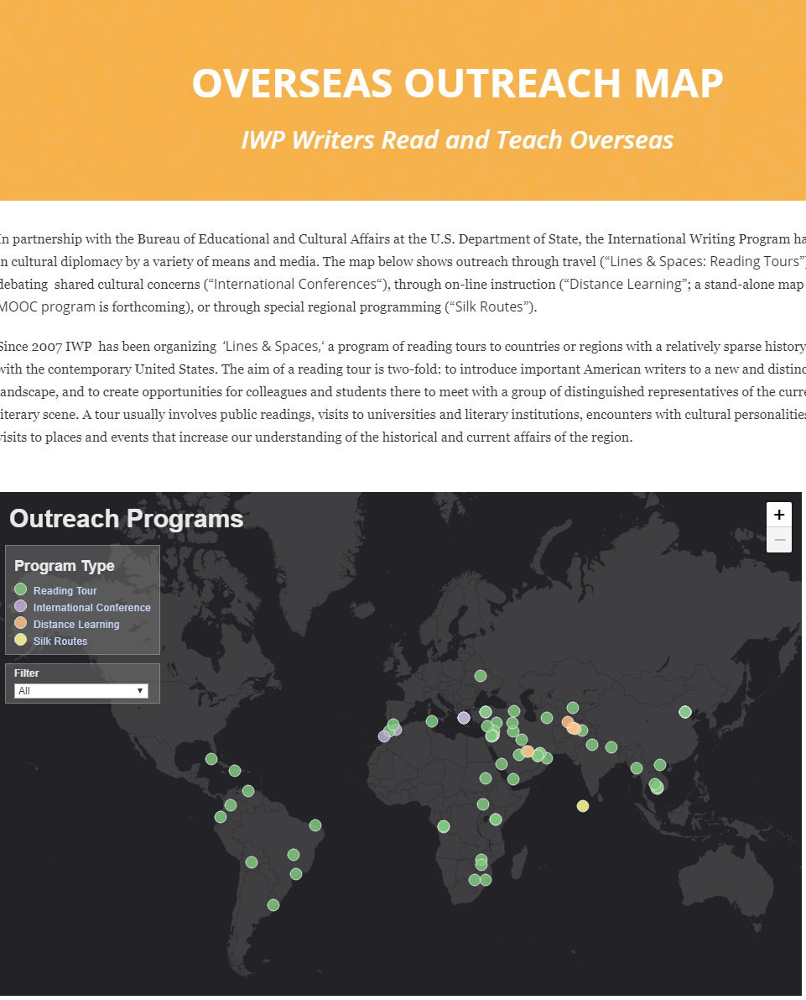
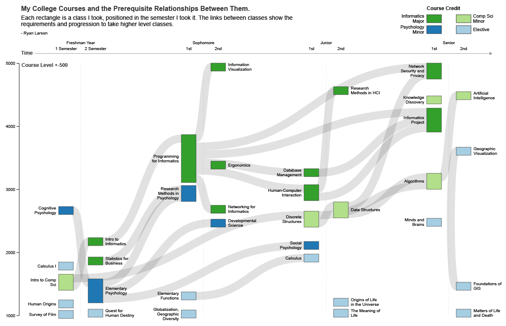
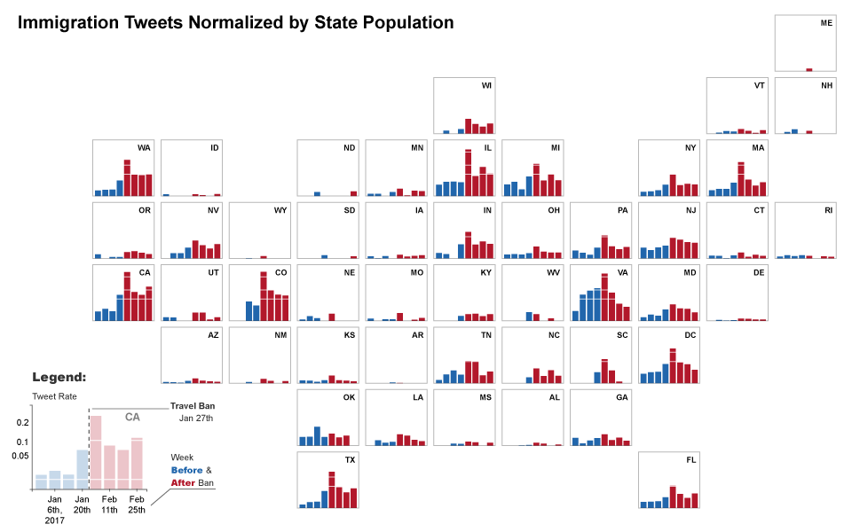
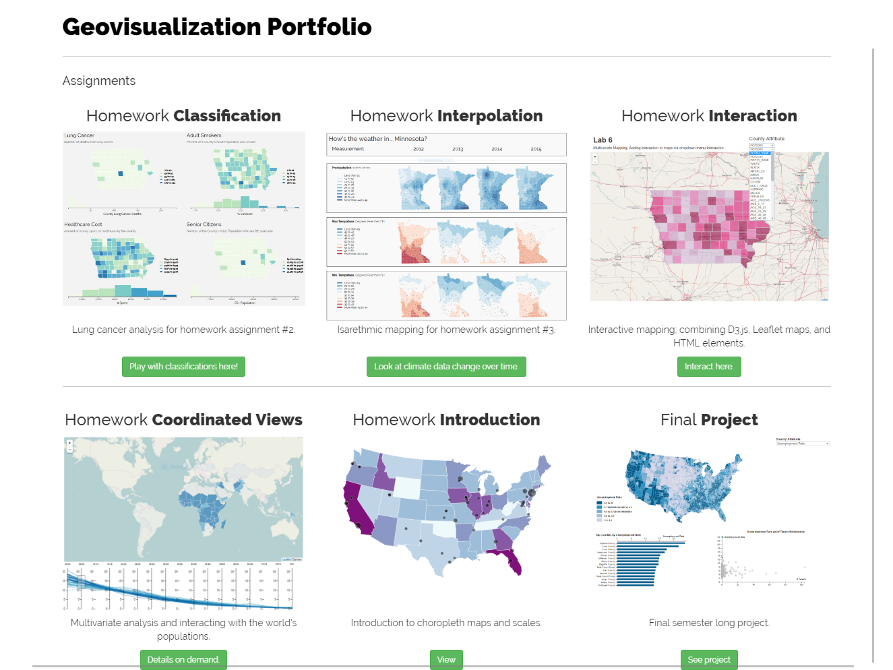
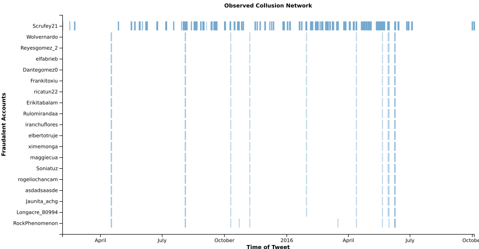
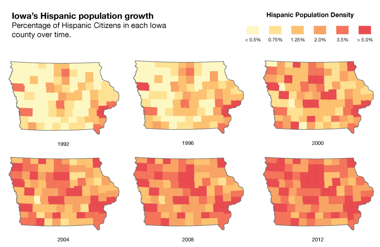
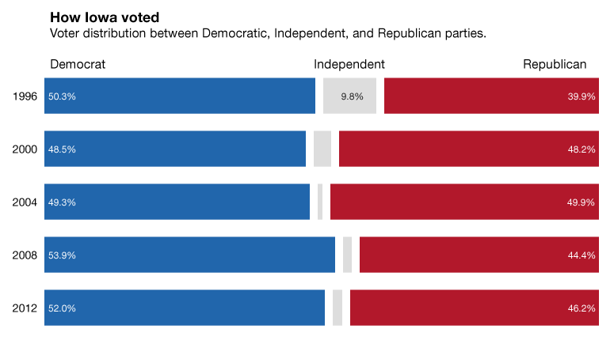
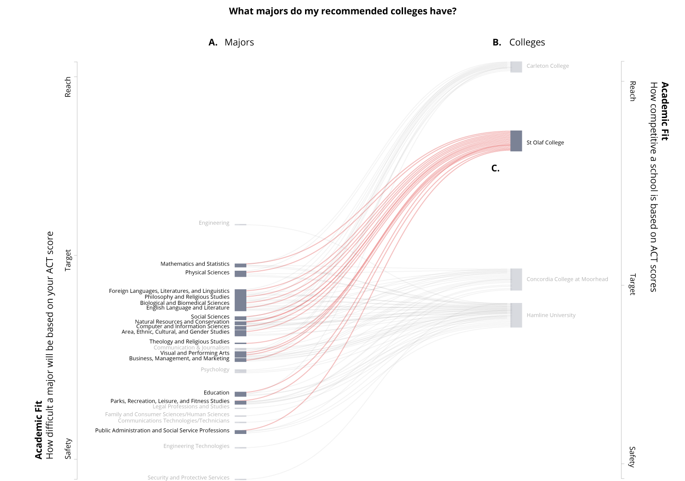
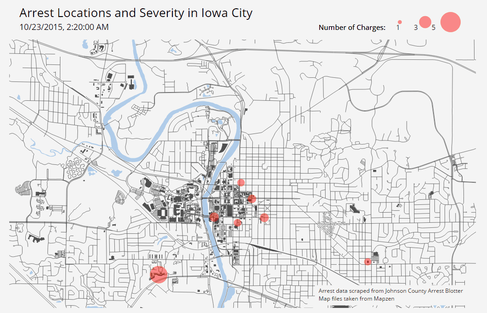

# Portfolio & CV
A repo to house my CV and highlight past projects.

### CV

Take a look at my CV [**here**](https://github.com/ryan-p-larson/CV/raw/master/Ryan-Larson-CV.pdf)!

### Previous Work

| Repository | Preview |
|---|---|
| [International Writer's Program Mapping Project](https://www.github.com/ryan-p-larson/iwp) | </img> |
| [College Curriculum Diagram](https://github.com/ryan-p-larson/college-sankey) | </img> |
| Cartogrid, from [*Understanding the Effect of the Travel Ban on Immigration Tweets in the United States*](https://github.com/ryan-p-larson/gviz) in Political Networks 2017 proceedings. | </img> |
| [Geographic Visualization Portfolio](https://geog3540.github.io/ryan-p-larson/) | </img> |
| Fake news and propoganda from  [*The Opinion Machine: An Aggregated Analysis of Political Spam on Twitter*](https://github.com/ryan-p-larson/polititweets). | </img> </img> |
| [Hispanic Vote in Iowa](https://github.com/ryan-p-larson/DI-Hisp), see it in the [Daily Iowan](http://daily-iowan.com/2016/11/02/el-voto/). | </img> </img> </img>|
| *State Recognition for Autonomous Vehicles* (closed source :[ ) | </img> |
| [ACT Internship - Continuum Reporting Project](https://github.com/ryan-p-larson/continuum-reporting) | </img> |
| [Iowa City Arrests](https://github.com/ryan-p-larson/arrests) | </img> |
