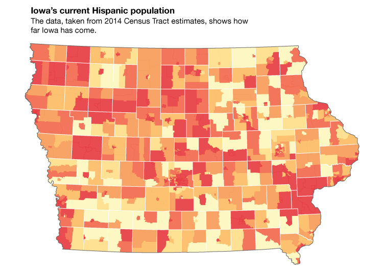

# Portfolio & CV
A repo to house my CV and highlight past projects.

### CV

Take a look at my CV [**here**](https://github.com/ryan-p-larson/CV/raw/master/Ryan-Larson-CV.pdf)!

### Previous Work

| Repository | Preview |
|---|---|
| ['College Curriculum Diagram'](https://github.com/ryan-p-larson/college-sankey) | </img> |
| ['Cartogrid', from *Understanding the Effect of the Travel Ban on Non-English Language Tweets in the United States * in Political Networks 2017 proceedings.](https://github.com/ryan-p-larson/gviz) | </img> |
| ['Fake news on Twitter'](https://github.com/ryan-p-larson/polititweets) | </img> |
| ['Hispanic Vote in Iowa'](https://github.com/ryan-p-larson/DI-Hisp), see it in the [Daily Iowan](http://daily-iowan.com/2016/11/02/el-voto/). | </img> </img> </img>|
| State Recognition for Autonomous Vehicles (closed source :[ ) | </img> |
| ['ACT - Continuum Reporting'](https://github.com/ryan-p-larson/continuum-reporting) | </img> |
| ['Iowa City Arrests'](https://github.com/ryan-p-larson/arrests) | </img> |
