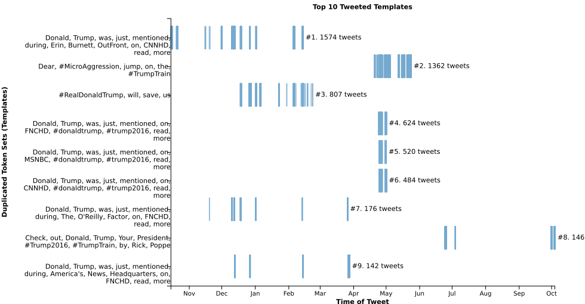
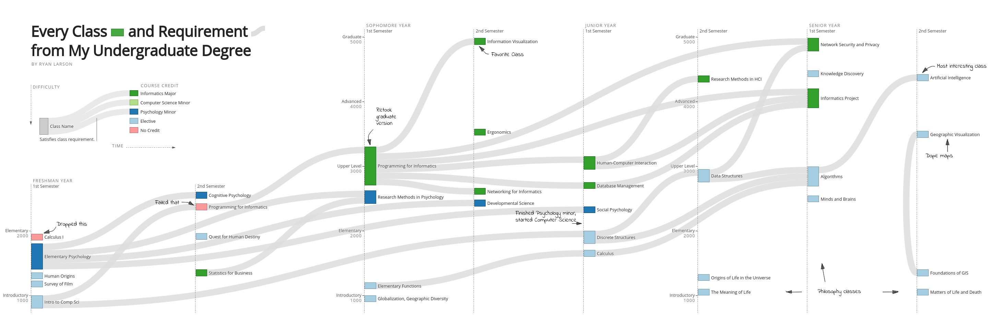

# Portfolio
Repository to house my resume and highlight past projects.

#### [View resume](https://github.com/ryan-p-larson/CV/raw/master/Ryan-Larson-CV.pdf)

| **Papers & Research** | Preview |
|---|---|
| *CarSentoGram: GeoVisual Text Analytics for Exploring Variation in Public Discourse on Twitter* ([demo](https://ryan-p-larson.github.io/paper/), [source](https://github.uiowa.edu/ckoylu/immigration), [publication](https://www.tandfonline.com/doi/full/10.1080/15230406.2018.1510343)). |    |
| Cartogrid, from [*Understanding the Effect of the Travel Ban on Immigration Tweets in the United States*](https://github.com/ryan-p-larson/gviz) in Political Networks 2017 proceedings. | </img> |
| Fake news and propoganda from  [*The Opinion Machine: An Aggregated Analysis of Political Spam on Twitter*](https://github.com/ryan-p-larson/polititweets). | </img> </img> |

---

| **Past Work** | Preview |
|---|---|
| CPHB-Events: An web application for managing events at The College of Public Health. Features include classroom calendars, drag'n'drop floorplan diagrams, and interactive forms. [View live!](https://cphb-events.public-health.uiowa.edu) |    |
| [ACT Internship - Continuum Reporting Project](https://github.com/ryan-p-larson/continuum-reporting) | </img> |

---

| **Personal Projects** | Preview |
|---|---|
| [College Curriculum Diagram](https://github.com/ryan-p-larson/college-sankey) | </img> |
| Higher Knowledge Graph ([source](https://github.com/ryan-p-larson/higher-knowledge-graph), [demo](https://ryan-p-larson.github.io/higher-knowledge-graph)) |  |
| [International Writer's Program Mapping Project](https://www.github.com/ryan-p-larson/iwp) | </img> |
| [Geographic Visualization Portfolio](https://geog3540.github.io/ryan-p-larson/) | </img> |
| [Hispanic Vote in Iowa](https://github.com/ryan-p-larson/DI-Hisp), see it in the [Daily Iowan](http://daily-iowan.com/2016/11/02/el-voto/). | </img> </img> </img> |
| [Iowa City Arrests](https://github.com/ryan-p-larson/arrests) | </img> |
| *Real-time headpose tracking using OpenCV and webcams* (closed source :[ ) | </img> |
